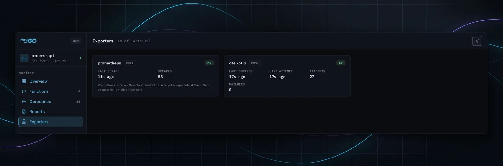

MoniGo publishes the same runtime metrics through two paths. Prometheus
**scrapes** MoniGo; MoniGo **pushes** to an OpenTelemetry collector. Both
report the same figures under the same names, so a scrape and a push cannot
disagree.

## Prometheus

The `/metrics` endpoint is registered automatically — there is nothing to
configure. Point a scrape at it:

```yaml
scrape_configs:
  - job_name: my-service
    static_configs:
      - targets: ['localhost:8080']
```

Exposed metrics:

| Metric | Type |
|---|---|
| `monigo_cpu_usage_percent` | gauge |
| `monigo_memory_usage_bytes` | gauge |
| `monigo_goroutines_count` | gauge |
| `monigo_disk_read_bytes_total` | counter |
| `monigo_disk_write_bytes_total` | counter |

:::note[Mounting the dashboard]
`/metrics` sits at the root, not under the API base path. If you register
MoniGo through `RegisterDashboardHandlers` or the Fiber handler, make sure you
are on **v1.7.0 or later** — earlier releases returned HTTP 500 on that path
under those handlers, which Prometheus reads as a target being down.
:::

## OpenTelemetry

```go
monigoInstance := monigo.NewBuilder().
    WithServiceName("my-service").
    WithOTelEndpoint("otel-collector:4317").
    Build()
```

Metrics are pushed over OTLP/gRPC every 30 seconds, with the first export
running at startup rather than waiting for the first tick.

:::caution[Upgrade if you are below v1.7.0]
Before v1.7.0, `WithOTelEndpoint` connected to the collector and then **sent
nothing at all** — no error, no warning, and a log line reading
`OTel exporter initialized`. If you configured OTel export on an earlier
release and never saw data arrive, this is why.
:::

## Reading exporter status

The dashboard's **Exporters** page reports both paths, each in its own terms.



They are deliberately not flattened into one pass/fail, because they do not
mean the same thing:

| | Prometheus | OpenTelemetry |
|---|---|---|
| Direction | pull — it scrapes MoniGo | push — MoniGo sends |
| Reports | last scrape, scrape count | last attempt, last success, consecutive failures, the transport error |
| Failure count | **none** | yes |

Prometheus carries no failure count because a failed scrape fails at the
collector — the server never learns of it. Showing `0 failures` there would
assert a health signal that does not exist.

A configured exporter that has not run yet is listed as idle rather than
omitted: absent from the page is indistinguishable from not configured, which
is the one distinction worth having when you are checking whether export works.

### States

| State | Meaning |
|---|---|
| `ok` | last attempt succeeded |
| `retrying` | failing now, has succeeded before |
| `failing` | failing and has never succeeded — usually a wrong endpoint or no route |
| `idle` / `not scraped` | configured, nothing has happened yet |

## API

```
GET /monigo/api/v1/exporters
```

```json
{
  "exporters": [
    { "name": "prometheus", "kind": "pull", "state": "ok", "total": 53,
      "last_success": "2026-08-30T14:16:31Z" },
    { "name": "otel-otlp", "kind": "push", "state": "ok", "total": 27,
      "failures": 0, "consecutive_failures": 0,
      "last_success": "2026-08-30T14:16:14Z",
      "last_attempt": "2026-08-30T14:16:14Z" }
  ]
}
```

Push-only fields are omitted for pull exporters rather than sent as zeros, and
unset timestamps are omitted rather than serialised as a zero time.
