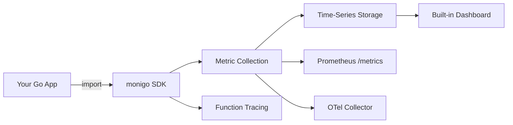

**MoniGo** is a performance monitoring library for Go applications. It provides real-time insights into application performance with an intuitive user interface, enabling developers to track and optimize both service-level and function-level metrics.

## Features

- **Asynchronous Telemetry Pipeline** — Decoupled metric collection from processing to ensure zero impact on application latency.
- **Adaptive Sampling** — Intelligent function tracing that only captures heavy profiles (CPU/Heap) for a sampled percentage of calls, significantly reducing overhead.
- **Pluggable Storage Layer** — Supports both persistent disk storage (via `tstorage`) and volatile in-memory storage for containerized or short-lived environments.
- **Headless Mode** — Run MoniGo as a background telemetry agent without the dashboard UI.
- **Real-Time Monitoring** — Access up-to-date performance metrics for your Go applications.
- **Detailed Insights** — Track and analyze both service and function-level performance.
- **Disk I/O Monitoring** — Monitor disk read/write bytes and system disk load.
- **Customizable Dashboard** — Manage performance data with an easy-to-use UI.
- **Visualizations** — Utilize graphs and charts to interpret performance trends.
- **Custom Thresholds** — Configure custom thresholds for your application's performance and resource usage.
- **Prometheus Integration** — Built-in `/metrics` endpoint for Prometheus scraping.
- **OpenTelemetry Export** — Send metrics to any OTel Collector via OTLP/gRPC.
- **Security Middleware** — Built-in Basic Auth, API Key, IP Whitelist, and Rate Limiting middleware.
- **Graceful Shutdown** — Automatic SIGINT/SIGTERM handling with proper cleanup via `Shutdown(ctx)`.

## What's New in v2.0.0

- **context.Context support** — All tracing functions now accept `context.Context` as the first parameter.
- **OpenTelemetry export** — Send metrics to any OTel Collector via `WithOTelEndpoint()`.
- **Structured logging** — Uses `log/slog` — configure via `WithLogLevel()` or `WithLogger()`.
- **Graceful shutdown** — SIGINT/SIGTERM triggers proper cleanup.
- **Builder validation** — `Build()` validates config at construction time.
- **Decoupled storage types** — Storage interface uses monigo-owned types (no tstorage leak).

## Architecture

